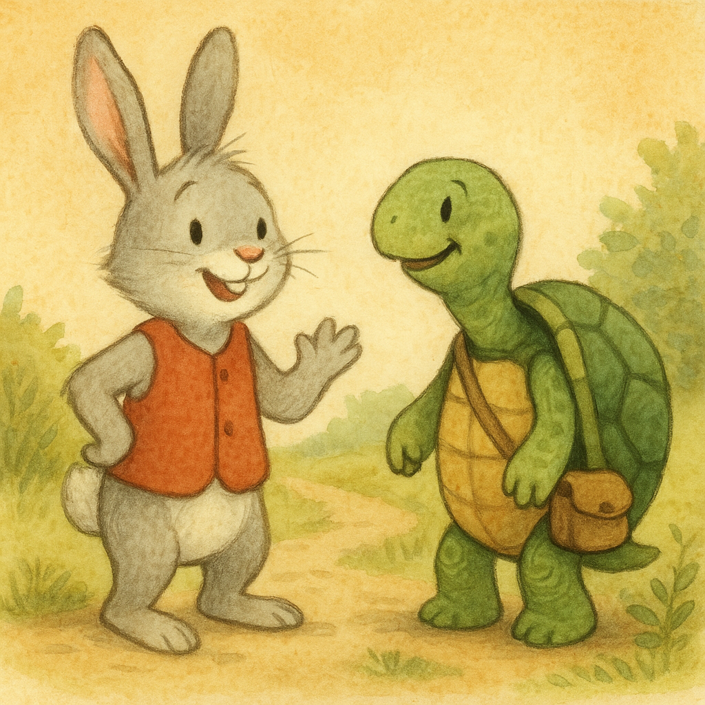

Кролик: Привіт, Черепахо! Знову йдеш так повільно?
Черепаха: Так, але зате впевнено.

Кролик: А я можу пробігти від дерева до гори й назад швидше, ніж ти зробиш кілька кроків!
Черепаха: Можливо. Але головне ж не швидкість, а куди ми зрештою дійдемо.

Кролик: Хм… може, ти й права. То йдемо разом?
Черепаха: З радістю. Тоді ми точно дійдемо обидва.

Кролик: А знаєш що? Я навіть можу сповільнитися трохи.
Черепаха: Це дуже мило з твого боку. А я спробую прискоритися.

Кролик: Дивись, яка гарна стежка попереду!
Черепаха: Так, і вона веде прямо до того красивого озера.

Кролик: Коли ми дійдемо, можемо відпочити біля води.
Черепаха: Чудова ідея. Разом завжди краще.
